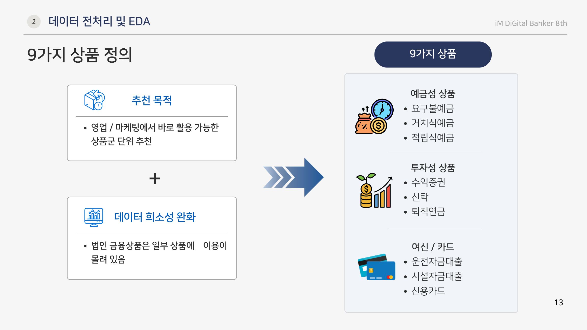
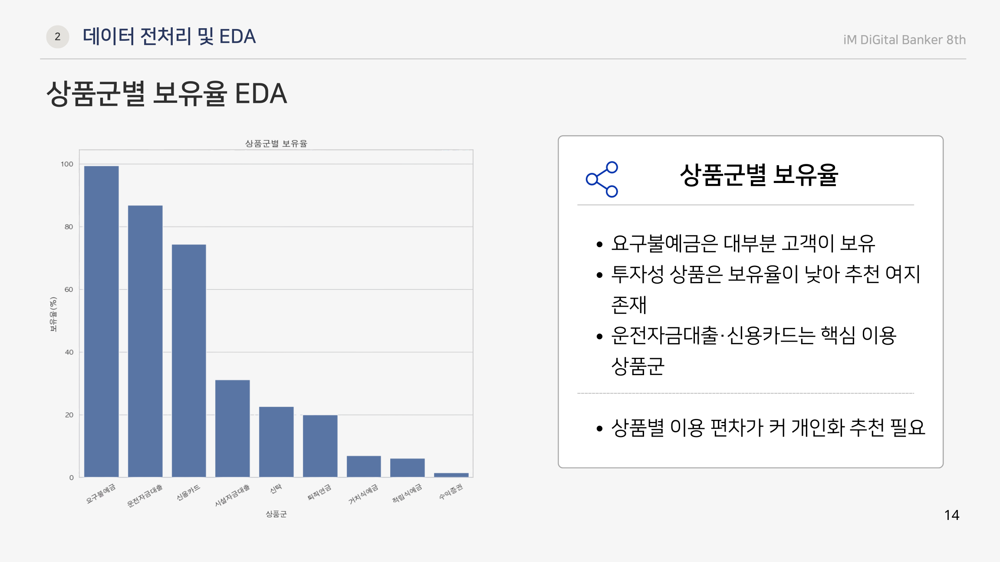
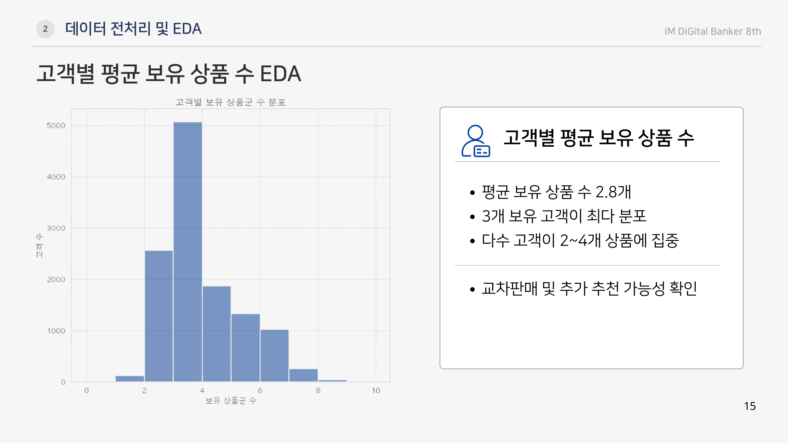
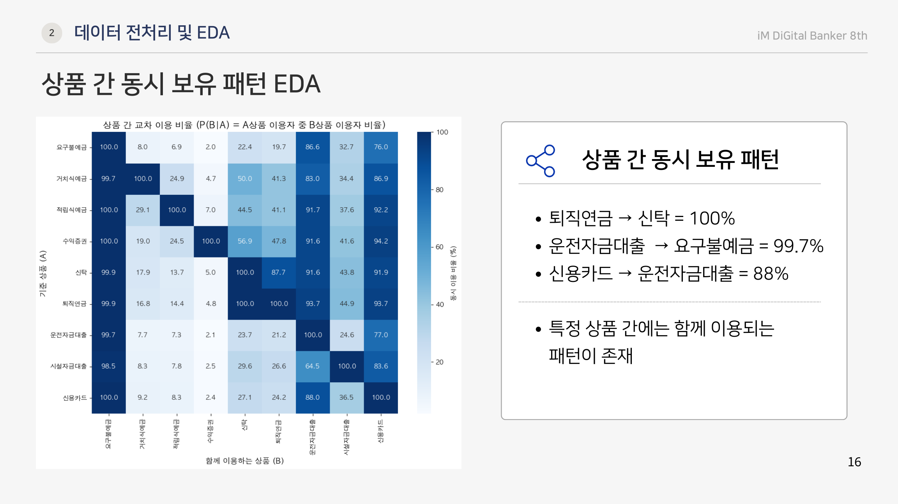

# 법인고객 금융상품 추천 시스템

법인고객의 과거 금융상품 보유 이력과 금융거래 특성을 함께 활용해, 다음 기간에 새롭게 보유할 가능성이 높은 금융상품을 추천하는 프로젝트입니다. 단순 인기상품 추천이 아니라 고객별 미보유 상품에 대해 `Item-based CF` 점수와 머신러닝 기반 신규보유 확률을 결합해 Top-K 추천 리스트를 생성했습니다.

## 1. 프로젝트 목표

- 법인고객별 미보유 금융상품의 신규보유 가능성 예측
- 협업필터링 기반 추천과 머신러닝 기반 예측의 장단점 비교
- 최종적으로 `Item-CF + ExtraTrees Hybrid` 방식으로 개인화 추천 점수 산출
- 추천 결과를 `NDCG@3`, `MAP@3`, `HitRate@3` 등 순위 기반 지표로 검증

## 2. 사용 데이터

- 기간: 2023년 1월 ~ 2025년 12월
- 전체 행 수: 365,988건
- 전체 법인 수: 15,473개
- 원본 컬럼 수: 70개
- 주요 정보: 예금, 대출, 신탁, 퇴직연금, 카드, 채널 거래금액, 거래건수, 업종, 지역, 고객등급 등

원본 데이터는 교육용 익명 금융 데이터이므로 저장소에는 포함하지 않았습니다.

## 3. EDA 기반 주제 선정 근거

초기 EDA에서는 법인고객의 상품 보유 구조가 균일하지 않고, 일부 상품군에 보유가 집중되는 것을 확인했습니다. 요구불예금처럼 대부분 고객이 이미 보유한 상품도 있었지만, 투자성 상품과 일부 여신 상품은 보유율이 상대적으로 낮아 추가 추천 여지가 있었습니다.

고객별 보유 상품 수를 확인한 결과 평균 보유 상품 수는 약 `2.8개`였고, 다수 고객이 `2~4개` 상품에 집중되어 있었습니다. 즉 대부분의 법인이 모든 상품을 폭넓게 이용하기보다 일부 상품만 보유하고 있어, 미보유 상품군을 대상으로 한 교차판매 추천 문제가 성립한다고 판단했습니다.

상품 간 동시 보유 패턴도 확인했습니다. 예를 들어 `퇴직연금 → 신탁` 동시 보유 비율은 `100%`, `운전자금대출 → 요구불예금`은 `99.7%`, `신용카드 → 운전자금대출`은 `88%`로 나타났습니다. 이처럼 특정 상품을 보유한 고객이 함께 보유하는 상품 패턴이 존재했기 때문에, 고객-상품 보유 행렬을 활용한 협업필터링 방식이 프로젝트 주제에 적합하다고 판단했습니다.

정리하면 EDA 결과는 다음 세 가지 방향을 보여줬습니다.

- 고객별 보유 상품 수가 제한적이라 미보유 상품 추천 여지가 있음
- 상품군별 보유율 편차가 커 일괄 추천보다 개인화 추천이 필요함
- 상품 간 동시 보유 패턴이 뚜렷해 Item-based CF를 적용할 근거가 있음

EDA 시각화는 아래 슬라이드에서 확인할 수 있습니다.

| 상품군 정의 | 상품군별 보유율 |
|---|---|
|  |  |

| 고객별 평균 보유 상품 수 | 상품 간 동시 보유 패턴 |
|---|---|
|  |  |

## 4. 상품군 정의

분석 대상 상품군은 총 9개로 정의했습니다.

상품군은 영업 및 마케팅에서 바로 활용 가능한 단위로 묶었습니다. 원본 데이터에는 운전자금대출 내부의 할인어음, 당좌대출, 일반자금대출처럼 더 세분화된 컬럼도 존재하지만, 세부 상품 단위로 나누면 보유 고객 수가 희소해지고 추천 결과도 영업 액션으로 해석하기 어려워집니다. 따라서 본 프로젝트에서는 예금성 상품, 투자성 상품, 여신/카드 상품을 대표 상품군 단위로 정리했습니다.

| 상품군 | 보유 판단 기준 |
|---|---|
| 요구불예금 | 요구불예금좌수 |
| 거치식예금 | 거치식예금좌수 |
| 적립식예금 | 적립식예금좌수 |
| 수익증권 | 수익증권좌수 |
| 신탁 | 신탁좌수 |
| 퇴직연금 | 퇴직연금좌수 |
| 운전자금대출 | 여신_운전자금대출좌수 |
| 시설자금대출 | 여신_시설자금대출좌수 |
| 신용카드 | 신용카드개수 |

## 5. 라벨링 방식

고객과 상품의 조합 단위로 신규보유 여부를 정의했습니다.

- 전년도 미보유, 다음 연도 보유: `Y=1`
- 전년도 미보유, 다음 연도 미보유: `Y=0`
- 전년도 이미 보유한 상품: 추천 대상에서 제외

월별 샘플링 데이터 특성을 고려해 특정 월 값이 아니라 연도 단위 보유 여부를 사용했습니다. 비교하는 두 연도에 모두 관측된 고객만 사용해, 특정 연도에만 등장한 고객을 신규보유 고객으로 잘못 판단하는 문제를 줄였습니다.

## 6. 데이터 분할

| 구분 | 입력 정보 | 정답 | 목적 |
|---|---|---|---|
| 학습 및 튜닝 | 2023년 고객 정보 | 2024년 신규보유 상품 | 모델 학습 및 후보 선택 |
| 최종 테스트 | 2024년 고객 정보 | 2025년 신규보유 상품 | 미래 구간 성능 검증 |

최종 평가 고객 수는 2025년에 실제 신규보유 상품이 발생한 653개 법인입니다.

## 7. 모델링 구조

### 7.1 Item-based Collaborative Filtering

고객-상품 보유 행렬을 만들고, 상품 간 동시 보유 패턴을 기반으로 상품 유사도를 계산했습니다. 고객이 이미 보유한 상품과 유사한 미보유 상품을 추천 후보로 산출했습니다.

먼저 추천 시스템의 기본 성능을 확인하기 위해 `Random`, `Popularity`, `Item-based CF`를 비교했습니다. 그 결과 Item-based CF가 Popularity와 Random보다 높은 순위 성능을 보여, 상품 보유 패턴 기반 추천이 이 데이터에서 유의미하다고 판단했습니다.

| 방식 | K | HitRate | Precision | Recall | MAP | NDCG |
|---|---:|---:|---:|---:|---:|---:|
| Item-based CF | 3 | 0.816641 | 0.354391 | 0.795455 | 0.663071 | 0.701371 |
| Popularity | 3 | 0.801233 | 0.347714 | 0.778249 | 0.651986 | 0.688772 |
| Random | 3 | 0.676425 | 0.255778 | 0.595146 | 0.396935 | 0.462360 |

추천 성능은 `K=1`, `K=2`, `K=3`, `K=5` 기준으로 함께 비교했습니다. K가 커질수록 정답 상품이 추천 목록 안에 들어갈 가능성은 높아졌지만, K=5에서는 Random 방식조차 HitRate가 `0.910632`까지 올라가 평가 변별력이 크게 낮아졌습니다. 따라서 후보를 많이 던져서 맞히는 구조를 피하고, 모델 간 성능 차이가 유지되는 `K=3`을 최종 비교 기준으로 설정했습니다.

| K | 방식 | HitRate | Precision | Recall | MAP | NDCG |
|---:|---|---:|---:|---:|---:|---:|
| 1 | Item-based CF | 0.556240 | 0.556240 | 0.470981 | 0.556240 | 0.556240 |
| 1 | Popularity | 0.542373 | 0.542373 | 0.463277 | 0.542373 | 0.542373 |
| 1 | Random | 0.232666 | 0.232666 | 0.174499 | 0.232666 | 0.232666 |
| 2 | Item-based CF | 0.730354 | 0.432974 | 0.667309 | 0.612866 | 0.638569 |
| 2 | Popularity | 0.728814 | 0.430663 | 0.665254 | 0.607088 | 0.633423 |
| 2 | Random | 0.465331 | 0.248844 | 0.384694 | 0.309322 | 0.345117 |
| 3 | Item-based CF | 0.816641 | 0.354391 | 0.795455 | 0.663071 | 0.701371 |
| 3 | Popularity | 0.801233 | 0.347714 | 0.778249 | 0.651986 | 0.688772 |
| 3 | Random | 0.645609 | 0.243451 | 0.564201 | 0.354263 | 0.421660 |
| 5 | Item-based CF | 0.983051 | 0.257319 | 0.980611 | 0.713236 | 0.781922 |
| 5 | Popularity | 0.981510 | 0.257319 | 0.979712 | 0.704924 | 0.774710 |
| 5 | Random | 0.910632 | 0.230817 | 0.880971 | 0.455305 | 0.568809 |

클러스터링을 적용해 군집별로 CF를 수행하는 방식도 검토했습니다. 다만 K-Means 군집화 후 군집 내부에서 CF를 적용했을 때 단독 Item-based CF보다 성능이 낮아, 최종 추천 구조에서는 군집별 CF가 아니라 전체 고객 기준 Item-based CF를 사용했습니다.

### 7.2 머신러닝 모델 후보 탐색

협업필터링은 상품 보유 패턴을 잘 반영하지만 업종, 지역, 거래 규모, 고객등급 같은 고객 특성을 직접 반영하기 어렵습니다. 이를 보완하기 위해 상품별로 독립적인 머신러닝 모델을 학습했습니다.

먼저 AutoML을 활용해 후보 모델군을 빠르게 탐색했습니다. 이후 후보 모델을 직접 비교하기 위해 `ExtraTrees`, `RandomForest`, `XGBoost`, `LogisticRegression`, `LightGBM`, `HistGradientBoosting`을 동일한 조건에서 학습하고, 각 모델의 ML 점수를 Item-based CF 점수와 5:5로 결합해 성능을 비교했습니다.

| 모델 | 결합 방식 | K | HitRate | Precision | Recall | MAP | NDCG |
|---|---|---:|---:|---:|---:|---:|---:|
| ExtraTrees | CF 50% + ML 50% | 3 | 0.886677 | 0.356815 | 0.847626 | 0.657053 | 0.712897 |
| RandomForest | CF 50% + ML 50% | 3 | 0.888208 | 0.352221 | 0.838948 | 0.654586 | 0.710827 |
| XGBoost | CF 50% + ML 50% | 3 | 0.857580 | 0.335886 | 0.808321 | 0.637315 | 0.690172 |
| LogisticRegression | CF 50% + ML 50% | 3 | 0.866769 | 0.334865 | 0.812532 | 0.627574 | 0.684919 |
| LightGBM | CF 50% + ML 50% | 3 | 0.842266 | 0.325676 | 0.796197 | 0.618640 | 0.673018 |
| HistGradientBoosting | CF 50% + ML 50% | 3 | 0.820827 | 0.319040 | 0.783435 | 0.621661 | 0.670234 |

ExtraTrees는 NDCG@3와 MAP@3 기준에서 가장 높은 성능을 보였고, RandomForest 대비 HitRate는 근소하게 낮았지만 순위 품질 지표인 NDCG와 MAP에서 우세했습니다. 본 프로젝트는 추천 상품이 Top-3 안에 들어가는 것뿐 아니라 상위 순위에 잘 배치되는지가 중요하므로, 최종 모델 후보로 ExtraTrees를 채택했습니다.

### 7.3 Optuna 하이퍼파라미터 튜닝

선정된 ExtraTrees 모델은 Optuna로 하이퍼파라미터 튜닝을 수행했습니다. 최종 테스트 데이터인 2025년은 건드리지 않고, 2023년 정보로 2024년 신규보유를 예측하는 학습 구간에서 내부 8:2 검증을 사용했습니다.

| 항목 | 값 |
|---|---|
| n_estimators | 573 |
| max_depth | 33 |
| min_samples_leaf | 30 |
| min_samples_split | 43 |
| max_features | 0.3 |
| class_weight | balanced |

튜닝 과정의 내부 검증 성능은 NDCG@3 `0.7308`, MAP@3 `0.6855`, HitRate@3 `0.8647`로 확인했습니다. 이 값은 최종 테스트 성능이 아니라 2023→2024 학습 구간 내부 검증 결과입니다.

### 7.4 Hybrid 추천 점수

각 고객별 미보유 상품에 대해 CF 점수와 ML 확률 점수를 각각 행 단위로 정규화한 뒤 5:5 비율로 결합했습니다.

```python
score_final = 0.5 * cf_score_normalized + 0.5 * ml_score_normalized
```

이 점수를 기준으로 고객별 미보유 상품을 정렬해 최종 추천 리스트를 생성했습니다.

## 8. 피처셋 실험

피처 수를 조절하며 `ALL`, `TOP30`, `TOP50`, `TOP100`, `FI70`, `FI80`, `FI90` 피처셋을 비교했습니다. 주요 피처만 남기는 방식도 실험했지만, 전체 피처셋이 가장 안정적인 성능을 보였습니다.

| 피처셋 | 피처 수 | NDCG@3 | MAP@3 | HitRate@3 | Precision@3 | Recall@3 |
|---|---:|---:|---:|---:|---:|---:|
| ALL | 236 | 0.712897 | 0.657053 | 0.886677 | 0.356815 | 0.847626 |
| TOP50 | 50 | 0.712543 | 0.657946 | 0.885145 | 0.355283 | 0.842777 |
| FI90 | 91 | 0.711866 | 0.657989 | 0.879020 | 0.354773 | 0.840480 |
| TOP30 | 30 | 0.699173 | 0.646376 | 0.868300 | 0.350179 | 0.826697 |

## 9. 최종 테스트 성능

최종 모델은 `ExtraTrees + Item-CF Hybrid`이며, 2024년 정보로 2025년 신규보유 상품을 예측했습니다.

| 구분 | 모델 | 피처셋 | 결합 방식 | K | NDCG@3 | MAP@3 | HitRate@3 | Precision@3 | Recall@3 | 평가고객수 |
|---|---|---|---|---:|---:|---:|---:|---:|---:|---:|
| 2024→2025 최종 테스트 | ExtraTrees + Item-CF Hybrid | ALL | CF 50% + ML 50% | 3 | 0.716089 | 0.672877 | 0.845329 | 0.359877 | 0.821465 | 653 |

## 10. 주요 해석

피처 그룹 중요도 분석 결과 업종, 거래 활동성, 지역, 상품 보유 이력, 여신/대출 규모가 주요 설명 요인으로 나타났습니다. 이는 법인고객의 상품 수요가 단순 잔액 규모뿐 아니라 업종 특성, 거래 채널 활용도, 기존 상품 조합과 함께 움직인다는 점을 보여줍니다.

## 11. 저장소 구성

```text
.
|-- README.md
|-- notebooks/
|   `-- modeling_pipeline.ipynb
|-- docs/
|   |-- presentation.pdf
|   |-- presentation.pptx
|   `-- loop_engineering_review.md
`-- assets/
```

## 12. 실행 참고

원본 데이터는 비공개 교육용 데이터라 포함하지 않았습니다. 노트북 실행을 위해서는 동일한 컬럼 구조의 데이터 파일이 필요합니다.
